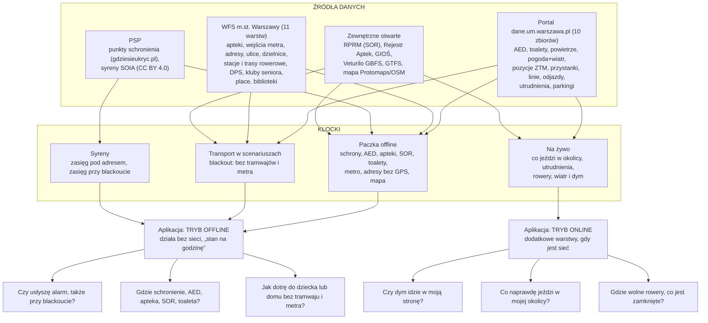

# Jak to się łączy: aplikacja dla mieszkańców (offline i online)

Wersja tylko dla osób prywatnych. Konsola miasta jest odłożona (zob. `rozwiazanie-podsumowanie.md`).

```mermaid
flowchart TB
  subgraph SRC["ŹRÓDŁA DANYCH"]
    P["Portal dane.um.warszawa.pl (10 zbiorów)<br/>AED, toalety, powietrze, pogoda+wiatr,<br/>pozycje ZTM, przystanki, linie, odjazdy,<br/>utrudnienia, parkingi"]
    W["WFS m.st. Warszawy (11 warstw)<br/>apteki, wejścia metra, adresy, ulice, dzielnice,<br/>stacje i trasy rowerowe, DPS, kluby seniora,<br/>place, biblioteki"]
    S["PSP<br/>punkty schronienia (gdziesieukryc.pl),<br/>syreny SOIA (CC BY 4.0)"]
    E["Zewnętrzne otwarte<br/>RPRM (SOR), Rejestr Aptek, GIOŚ,<br/>Veturilo GBFS, GTFS, mapa Protomaps/OSM"]
  end

  subgraph BLK["KLOCKI"]
    K1["Paczka offline<br/>schrony, AED, apteki, SOR, toalety,<br/>metro, adresy bez GPS, mapa"]
    K2["Transport w scenariuszach<br/>blackout: bez tramwajów i metra"]
    K4["Syreny<br/>zasięg pod adresem, zasięg przy blackoucie"]
    K3["Na żywo<br/>co jeździ w okolicy, utrudnienia,<br/>rowery, wiatr i dym"]
  end

  AOFF["Aplikacja: TRYB OFFLINE<br/>działa bez sieci, „stan na godzinę”"]
  AON["Aplikacja: TRYB ONLINE<br/>dodatkowe warstwy, gdy jest sieć"]

  P --> K1
  P --> K2
  P --> K3
  W --> K1
  W --> K2
  S --> K1
  S --> K4
  E --> K1
  E --> K2
  E --> K3

  K1 --> AOFF
  K2 --> AOFF
  K4 --> AOFF
  K3 --> AON

  AOFF --> Q1["Czy usłyszę alarm, także przy blackoucie?"]
  AOFF --> Q2["Gdzie schronienie, AED, apteka, SOR, toaleta?"]
  AOFF --> Q3["Jak dotrę do dziecka lub domu bez tramwaju i metra?"]
  AON --> Q4["Czy dym idzie w moją stronę?"]
  AON --> Q5["Co naprawdę jeździ w mojej okolicy?"]
  AON --> Q6["Gdzie wolne rowery, co jest zamknięte?"]
```
